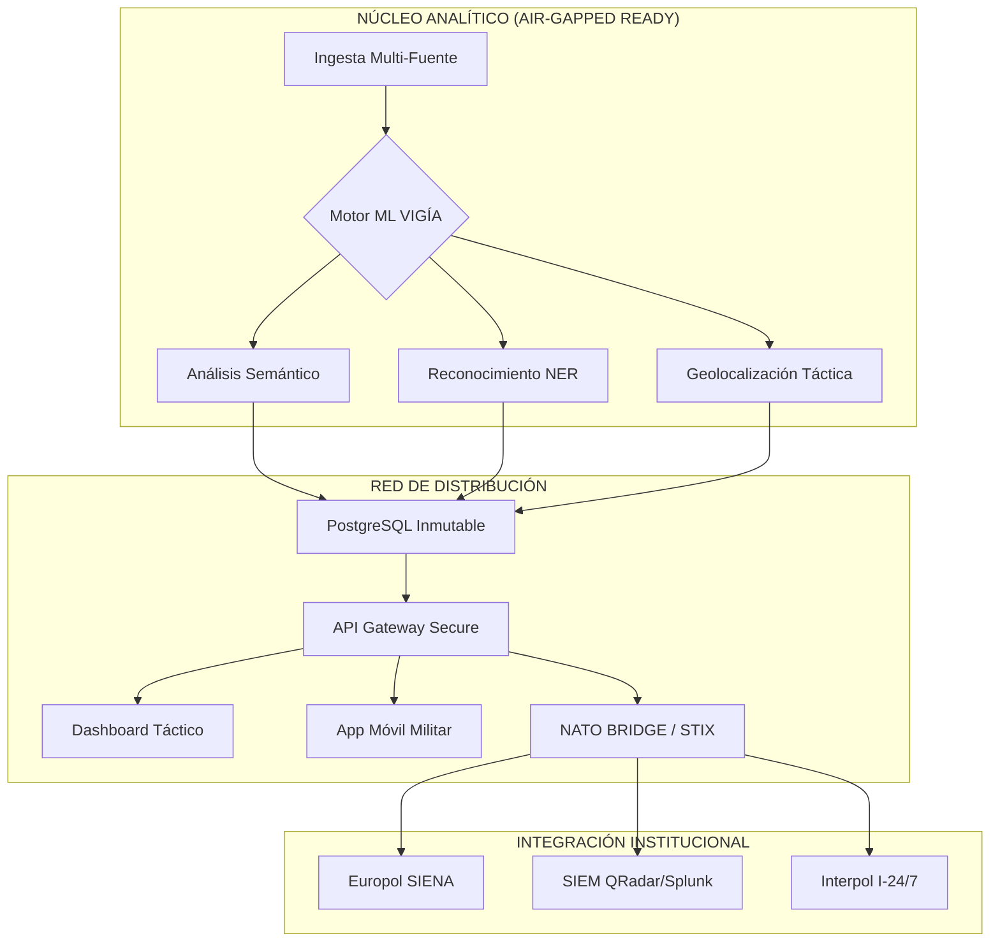

# 🛡️ VIGÍA v2.0 — PLATAFORMA DE INTELIGENCIA ESTATAL-MILITAR

<div align="center">
  
  
  
  <br>
  
  
  
</div>

---

## 👁️ VISIÓN GENERAL OPERATIVA

**VIGÍA v2.0** es la culminación de la ingeniería de inteligencia moderna. Diseñado como un puente tecnológico para la **OTAN (NATO Bridge)** y agencias de seguridad nacional, el sistema permite la monitorización masiva, análisis de sentimientos multilingüe y detección de patrones de insurgencia/amenazas en el espectro digital (OSINT/SOCMINT).

> [!IMPORTANT]
> **ADVERTENCIA DE SEGURIDAD**: Este software está sujeto a la **Ley 11/2002** y normativas de seguridad nacional. Su uso está restringido a personal con habilitación de seguridad activa.

---

## 🌌 ARQUITECTURA DE MISIÓN CRÍTICA



---

## 🚀 CAPACIDADES DE COMBATE DIGITAL

### 🔐 Blindaje Criptográfico
- **Integridad Inmutable**: Logs firmados con **HMAC-SHA256** para evitar manipulación forense.
- **Cifrado de Grado Militar**: Datos en reposo protegidos por **AES-256-GCM**.
- **Acceso Multinivel**: Esquema de habilitación **CONFIDENTIAL / SECRET / TOP SECRET**.
- **Autenticación Biométrica**: Integración total en dispositivos móviles para analistas de campo.

### 🧠 Inteligencia Artificial Multilingüe
- **Detección de Amenazas**: Algoritmos avanzados (Random Forest + BERT) entrenados para identificar léxico de insurgencia.
- **Soporte Global**: Análisis nativo en **Árabe, Chino, Ruso, Inglés y Español**.
- **Análisis de Grafos**: Visualización de redes de influencia y células durmientes mediante **D3/Cytoscape**.

### 🔗 Interconectividad Global (NATO Bridge)
- **STIX 2.1 / TAXII 2.1**: Estándar internacional para el intercambio de indicadores de compromiso (IoC).
- **Sincronización SIEM**: Integración nativa con **Splunk, ELK y QRadar**.
- **Exportación Forense**: Generación de informes en PDF cifrado y formatos estructurados para evidencia judicial.

---

## 🛠️ DESPLIEGUE TÁCTICO

### Despliegue Rápido (Docker)
```bash
# 1. Preparar perímetro
git clone https://github.com/murdok1982/SistemaVigiaSocmint.git && cd SistemaVigiaSocmint

# 2. Configurar claves de cifrado
openssl rand -hex 32 > .env_key
# Editar .env con las claves generadas

# 3. Lanzar sistema
docker-compose up -d --build
```

### Orquestación a Gran Escala (Kubernetes)
El sistema está optimizado para clusters **K8s** con auto-escalado y políticas de red restrictivas.
```bash
kubectl apply -f k8s/namespace.yaml
kubectl apply -f k8s/deployment.yaml -n vigia-system
```

---

## 📊 DASHBOARD Y CONTROL

- **Heatmaps en Tiempo Real**: Visualización geoespacial de focos de conflicto.
- **Cola de Alertas Priorizada**: Triaje automático basado en el nivel de riesgo (Crítico/Alto/Medio/Bajo).
- **Auditoría Total**: Registro de cada acción realizada por los analistas para trazabilidad completa.

---

## 📜 CLASIFICACIÓN Y LICENCIA

Este producto se distribuye bajo la **Licencia de Uso Restringido Estado-Militar (RSM-L)**.
- **PROHIBIDA** la redistribución.
- **PROHIBIDA** la ingeniería inversa.
- **USO EXCLUSIVO** gubernamental y defensa.

---

<div align="center">
  <p><strong>VIGÍA v2.0 — "Vigilantia Aeterna, Libertas Garantizada"</strong></p>
  
</div>
