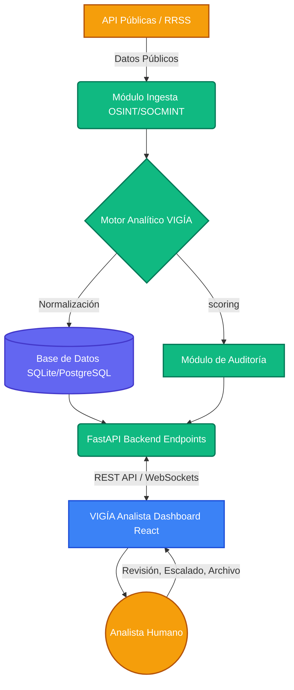
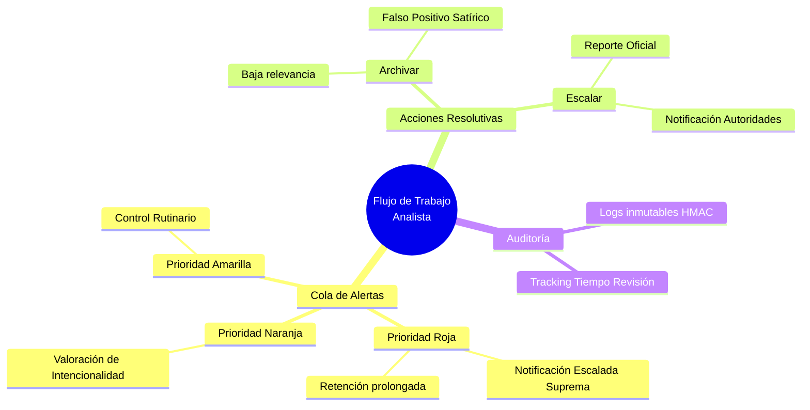

<div align="center">

# 👁️ VIGÍA
### Sistema Avanzado de Análisis OSINT/SOCMINT 🛡️
 
[](https://github.com/murdok1982/SistemaVigiaSocmint)
[](https://github.com/murdok1982/SistemaVigiaSocmint)
[](#)
[](#)

*Plataforma de inteligencia de fuentes abiertas centrada en la pre-detección pasiva y anonimizada de vectores de amenaza pública, con estricta supervisión humana ("Human in the Loop").*

---
</div>

## 📑 Índice
1. [Descripción del Proyecto](#-descripción-del-proyecto)
2. [Arquitectura del Sistema](#%EF%B8%8F-arquitectura-del-sistema)
3. [Niveles de Alerta y Análisis](#-niveles-de-alerta-y-análisis)
4. [Marco Operativo Legal](#%EF%B8%8F-marco-operativo-y-legal)
5. [Tecnologías Empleadas](#-tecnologías-empleadas)
6. [Instalación y Despliegue](#-instalación-y-despliegue)
7. [Mapa Conceptual](#-mapa-conceptual)

---

## 🔍 Descripción del Proyecto

**VIGÍA** es un sistema automatizado de recolección y análisis pasivo orientado a tareas **OSINT** (Open Source Intelligence) y **SOCMINT** (Social Media Intelligence). El sistema se encarga de monitorizar fuentes estrictamente públicas en busca de indicadores lingüísticos y de comportamiento vinculados a amenazas directas, coordinación de ataques y glorificación de elementos violentos, para presentarlos de manera estructurada a analistas humanos.

> [!IMPORTANT]
> **VIGÍA no toma decisiones operativas.** El sistema actúa exclusivamente como un filtro clasificador avanzado. Todo el flujo de decisión recae sobre analistas humanos designados, garantizando la proporcionalidad y el respeto irrestricto a los derechos fundamentales.

---

## 🏗️ Arquitectura del Sistema

El ecosistema se divide en una arquitectura desacoplada y asíncrona, orquestada de tal manera que las tareas de ingesta, análisis y revisión se encuentren auditablemente separadas.



---

## 🚦 Niveles de Alerta y Análisis

VIGÍA evalúa el _Risk Score_ en tiempo real, categorizando automáticamente el contenido según los indicadores detectados:

| Nivel | Rango Score | Descripción y Contexto | Protocolo Automático |
| :---: | :---: | :--- | :--- |
| 🟢 **VERDE** | `0.0` - `0.3` | Sin indicadores relevantes, debates estándar o contenido generalista. | Archivo automático (periódico). |
| 🟡 **AMARILLO**| `0.3` - `0.5` | Indicadores débiles, contexto ambiguo o lenguaje figurado/hiperbólico. | Cola estándar (Revisión <48h). |
| 🟠 **NARANJA** | `0.5` - `0.75` | Indicadores explícitos en contextos altamente tensionados o preocupantes. | Cola prioritaria (Revisión <4h). |
| 🔴 **ROJO** | `0.75` - `1.0` | Inminencia de amenaza o coordinación severa con intencionalidad demostrable. | Escalada inmediata (Revisión <1h). |

### 🎯 Vectores de Detección

- `llamada_violencia`
- `coordinacion_ataque`
- `glorificacion_terrorismo`
- `reclutamiento`
- `amenaza_directa`

---

## ⚖️ Marco Operativo y Legal

> [!CAUTION]
> El sistema despliega estrictos contrafuegos lógicos basados en normativas europeas y nacionales (RGPD, LOPD-GDD). 

**Restricciones Embebidas (Hardcoded Zero-Trust):**
1. 🚫 **Sin Identidades Falsas:** Interacción cero por diseño.
2. 🚫 **Sin Raspado Intrusivo:** Respeto estricto del protocolo `robots.txt` y normativas API.
3. 🚫 **Sin Perfilado Biométrico.**
4. 🚫 **Sin Sesgo Religioso/Político.** El modelo es ciego ante la disidencia pacífica.
5. 🔐 **Zero-Knowledge Logs:** Las identidades de red detectadas se guardan de forma hasheada hasta mandato humano.

---

## 🛠 Tecnologías Empleadas

### ⚙️ Backend
* **[FastAPI](https://fastapi.tiangolo.com/):** Framework de alto rendimiento.
* **Uvicorn / Pydantic:** ASGI y validación estricta de datos.
* **aiosqlite:** Gestión asíncrona de base de datos relacional.
* **CORS & Sec-Headers:** Políticas embebidas contra vectores de inyección/XSS.
* **Orquestador Lógico de IA:** Subsistema clasificador de inteligencia.

### 🎨 Frontend
* **[React 18](https://reactjs.org/) + [Vite](https://vitejs.dev/):** Interfaz ultrarrápida (HMR).
* **[TailwindCSS](https://tailwindcss.com/):** Sistema de utilidades para un diseño extremadamente reactivo y oscuro.
* **TypeScript / React Query:** Lógica fuertemente tipada y gestión del estado del servidor.

---

## 🧠 Mapa Conceptual

A continuación, un sub-mapa conceptual del módulo de decisión y escalada mental que sigue un Analista durante el uso del dashboard:



---

## 🚀 Instalación y Despliegue

### 1. Entorno Backend

```bash
# Navegar al directorio raíz / AgenteCNI
python -m venv venv
source venv/bin/activate  # En Windows: venv\Scripts\activate

# Instalación de dependencias
pip install -r requirements.txt

# Configurar entorno (.env local)
cp .env.example .env

# Ejecutar el servicio orquestador
uvicorn src.api:app --reload --host 127.0.0.1 --port 8000
```

### 2. Entorno Frontend

```bash
cd frontend

# Instalar Node Modules
npm install

# Lanzar Dashboard en modo desarrollo
npm run dev
```

---

<div align="center">
  <p><b>VIGÍA</b> está diseñado bajo estrictos parámetros éticos para balancear seguridad y privacidad.</p>
  <i>"El análisis perfecto es aquel que protege libertades garantizando derechos funcionales."</i>
</div>
